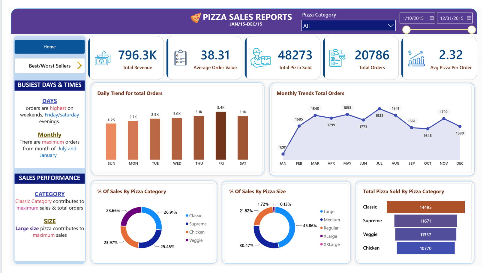
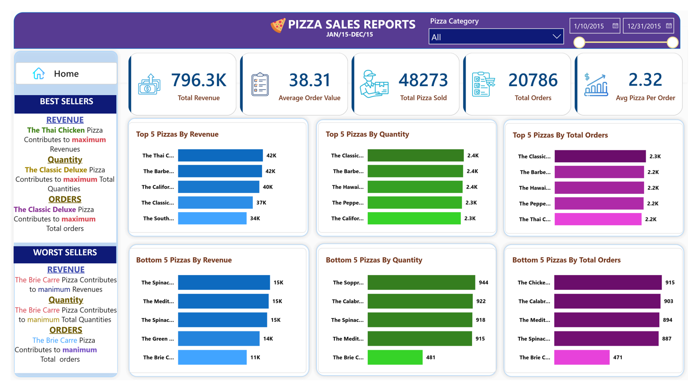

# 🍕 Pizza Sales Analytics | PostgreSQL, SQL, Power Query & Power BI

## 📌 Project Overview

This is an end-to-end **Pizza Sales Analytics** project developed to analyze sales performance and generate business-focused insights using **PostgreSQL, SQL, Power Query, and Microsoft Power BI**.

### End-to-End Workflow

**Raw Data → PostgreSQL → SQL Analysis → Power Query → Data Transformation → Power BI → Interactive Dashboard → Business Insights**

The objective is to transform raw pizza sales data into meaningful KPIs, trends, product performance analysis, and interactive business reporting.

---

## 🛠️ Tools & Technologies

- **PostgreSQL** — Database management and SQL analysis
- **SQL** — KPI calculations, trends, and product performance analysis
- **Power Query** — Data cleaning and transformation
- **Microsoft Power BI** — Interactive dashboard and data visualization
- **Excel/CSV** — Source data

---

## 📊 Key KPIs

- Total Revenue
- Average Order Value
- Total Pizzas Sold
- Total Orders
- Average Pizzas Per Order

---

## 🔎 SQL Analysis

Using PostgreSQL and SQL, the project analyzes:

### Sales Trends
- Daily order trends
- Monthly order trends

### Category & Size Analysis
- Revenue by pizza category
- Revenue by pizza size
- Pizza quantity by category

### Product Performance
- Top 5 pizzas by revenue
- Bottom 5 pizzas by revenue
- Top 5 pizzas by quantity
- Bottom 5 pizzas by quantity
- Top 5 pizzas by total orders
- Bottom 5 pizzas by total orders

### SQL Concepts Used

- SELECT
- WHERE
- GROUP BY
- ORDER BY
- Aggregate Functions
- DISTINCT
- Subqueries
- Filtering
- Data Aggregation
- Business-oriented analytical queries

---

## 📈 Power Query & Power BI

### Power Query
Power Query was used for data cleaning and transformation before dashboard development.

### Power BI
The interactive dashboard provides visual analysis of:

- Overall sales performance
- Revenue and order KPIs
- Daily and monthly trends
- Pizza category performance
- Pizza size contribution
- Top-performing products
- Underperforming products
- Interactive filters and slicers

---

## 💡 Business Insights

The project helps identify:

- Overall revenue and order performance
- Sales trends over time
- High-performing pizza products
- Underperforming products
- Category-level performance
- Size-level sales contribution
- Product performance based on revenue, quantity, and orders

These insights support business reporting and data-driven decision-making.

---

## 📂 Project Structure

```text
pizza-sales-analytics-sql-powerbi/
│
├── Dataset/
│   └── pizza_sales.csv
│
├── SQL/
│   └── pizza_sales_db.sql
│
├── Power BI/
│   └── Pizza Sales Dashboard.pbix
│
├── Screenshots/
│   ├── Dashboard-Pizza-I.png
│   └── Dashboard-Pizza-II.png
│
├── Excel/
│   └── pizza_sales_excel_file.xlsx
│
└── README.md
```

> Adjust file names and folders to match your final repository structure.

---

## 🖥️ Dashboard Preview

### Dashboard — Page 1



### Dashboard — Page 2



---

## 🔄 End-to-End Process

1. **Data Source** — Raw pizza sales data was used as the source dataset.
2. **PostgreSQL** — The dataset was imported into PostgreSQL for structured storage and analysis.
3. **SQL Analysis** — Business-focused queries were developed to calculate KPIs and analyze sales, orders, categories, sizes, and products.
4. **Power Query** — Data was cleaned and transformed.
5. **Power BI** — An interactive dashboard was developed using KPIs, trends, comparisons, and product analysis.
6. **Business Insights** — The final dashboard communicates analytical findings through clear visualizations.

---

## 🎯 Key Skills Demonstrated

- SQL & PostgreSQL
- Data Analysis
- Data Cleaning
- Data Transformation
- Power Query
- Power BI
- Data Visualization
- KPI Analysis
- Business Intelligence
- Dashboard Development
- Analytical Reporting
- Business Problem Solving

---

## 🚀 Project Objective

The objective was to demonstrate a complete Data Analytics workflow: taking raw business data, analyzing it using PostgreSQL and SQL, transforming it with Power Query, and communicating the results through an interactive Power BI dashboard.

---

## 🔗 LinkedIn Project Post

[View the project on LinkedIn](https://www.linkedin.com/feed/update/urn:li:activity:7499435136929931264/)

## 👤 About

This project is part of my **Data Analytics portfolio**, demonstrating practical work with **PostgreSQL, SQL, Power Query, Power BI, data visualization, and business analysis**.

I am building practical, business-focused projects to strengthen my capabilities in **Data Analytics and Business Intelligence**.

---

## 🏷️ Tags

`PostgreSQL` `SQL` `Power BI` `Power Query` `Data Analytics` `Business Intelligence` `Data Visualization` `Dashboard` `KPI` `Sales Analytics`

